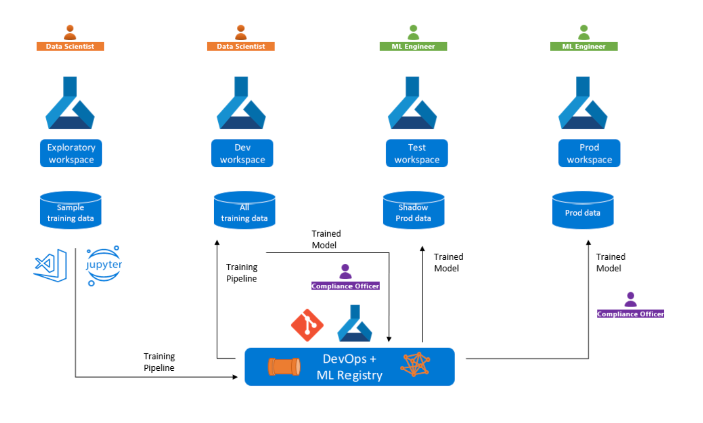

# Azure MLOps (v2) Training

This project demonstrates an end-to-end MLOps implementation using Azure Machine Learning and Azure DevOps pipelines. It includes infrastructure setup, model training, and deployment pipelines for both batch and online endpoints.

## Repo structure 

```bash
├── components - AzureML Components definitions
├── component - python scripts of ML workload
│   ├── prep
│   |   ├── prep.py - python script that reads raw data and prepare train, val and test datasets
│   ├── train
│   |   ├── train.py - python script that reads train data, trains and saves an ML model
│   ├── evaluate
│   |   ├── evaluate.py - python script that reads test data and trained model and evaluates model performance
│   ├── register
│   |   ├── register.py - python script that register trained model in AzureML Model Registry
│   ├── prep.yml - AzureML Component definition for `prep.py` 
│   ├── train.yml - AzureML Component definition for `train.py` 
│   ├── evaluate.yml - AzureML Component definition for `evaluate.py` 
│   ├── register.yml - AzureML Component definition for `register.py` 
├── data
│   ├── taxi-data.csv - data used for training & testing ML model
│   ├── taxi-batch.csv - data used as input for testing batch endpoint
│   ├── taxi-request.json - data used as input for testing online endpoint
├── devops-pipelines - Devops pipelines for MLOps
│   ├── deploy-model-training-pipeline.yml - Devops pipeline to run model training
│   ├── deploy-batch-endpoint-pipeline.yml - Devops pipeline for testing batch endpoint
│   ├── deploy-online-endpoint-pipeline.yml - Devops pipeline for testing online endpoint
├── environment - environments needed execute ML workload
│   ├── train-conda.yml - environment conda specification needed to execute python scripts in ML workload
├── ml-pipelines
│   ├── cli - CLI training/deployment pipeline exercise
│   │   ├── deploy - deploy pipeline assets
│   │   │   ├── batch - deploy batch pipeline assets
│   │   │   │   ├── batch-deployment.yml - deploy batch deployment template
│   │   │   │   ├── batch-endpoint.yml - deploy batch endpoint template
│   │   │   ├── online - deploy online pipeline assets
│   │   │   │   ├── online-deployment.yml - deploy online deployment template
│   │   │   │   ├── online-endpoint.yml - deploy online endpoint template
│   │   ├── train - training pipeline assets
│   │   |   ├── compute.yml - yaml configuration of AzureML training compute cluster
│   │   |   ├── data.yml - yaml configuration of AzureML training (input) data asset
│   │   |   ├── environment.yml - AzureML yaml configuration of training environment
│   │   |   ├── pipeline.yml - AzureML yaml configuration of training pipeline
│   │   |   ├── pipeline_automl.yml - AzureML yaml configuration of training pipeline
│   │   ├── azureml-cliv2.ipynb - CLI training/deployment pipeline notebook code sample
│   │   ├── train.sh - training pipeline CLI (Lab 01)
│   │   ├── deploy-batch-endpoint.ipynb - deploy batch pipeline notebook (Lab 02)
│   │   ├── deploy-online-endpoint.ipynb - deployment online pipeline notebook (Lab 02)
│   ├── sdk - SDK training/deployment pipeline exercise
│   │   ├── train-sdkv2.ipynb - training pipeline SDK (Lab 01)
│   │   ├── deploy-batch-endpoint-sdkv2.ipynb - deploy batch pipeline notebook (Lab 02)
│   │   ├── deploy-online-endpoint0sdkv2.ipynb - deployment online pipeline notebook (Lab 02)
```

## MLOps v2 Lab

In this workshop, we provided both CLI and SDK exercise. You can choose your preferred option. The exercise starts from ml-pipeline folder. 

There are 3 labs in this workshop, with an optional lab4:

## Lab 1. Building a training pipeline. It can be a custom model pipeline or automl pipeline.
  - Experiment with notebooks in `notebooks` folder to explore data and model 
  - Update .env.sample and fill the respective subscription, resource group and workspace values. Rename file to .env. 
  - Build pipeline by navigating to `ml-pipelines` and run ml-pipelines\sdk\train-sdkv2.ipynb
  - Review components of the pipeline and fill in missing parts and references 
  - Once pipeline is run, Model will be trained and registered in the WS registry

## Lab 2. Building a deployment pipeline, it could either be an online endpoint or batch endpoint. 
  - Deploy Model by navigating to `ml-pipelines` and running corresponding notebooks for batch deployment ml-pipelines\sdk\deploy-batch-endpoint-sdkv2.ipynb or online deployment ml-pipelines\sdk\deploy-online-endpoint-sdkv2.ipynb

## Lab 3. CICD

The following steps show how to run the model training and deployment pipeline via Azure devops pipelines using Azure ML Cli extension. For simulating the same flow with  SDKv2, we jump to step 3.2.

#### 3.1a Set up Azure DevOps Repository

1. Verify/Update the resource names, service connection names in ./config-infra-dev.yml and ./config-infra-prod.yml files.
2. Provide a unique <batch-endpoint-name> in ml-pipelines/cli/deploy/batch/batch-deployment.yml and ml-pipelines/cli/deploy/batch/batch-endpoint.yml
3. Create an organization(if not already there) in Azure DevOps and add a project
4. Initialize a Git repository and clone it to your local machine
5. Add this code to your repository:

```powershell
# Initialize git repository (if not already done)
git init
git add .
git commit -m "Initial commit"

# Create and switch to dev branch
git checkout -b dev

# Push to remote repository (replace with your repository URL)
git remote add origin <your-repository-url>   OR
git remote set-url origin <your-repository-url>
git push -u origin dev
```
#### 3.1b Set up Variable Groups
In Azure DevOps , Within **Project** Go to Library inside Pipelines. Create variable groups DevVars and ProdVars with the following variables:
- resource_group
- workspace_name
  


#### 3.1c Create Azure DevOps Pipelines
To set up the CI/CD pipelines in Azure DevOps:
1. In Azure DevOps, navigate to **Pipelines** in the left sidebar
2. Click on **New pipeline**
3. Select **Azure Repos Git** as your code repository source
4. Select your repository from the list
5. Choose **Existing Azure Pipelines YAML file**
6. Select the branch (typically `dev` or `main`)
7. In the path dropdown, select one of the following pipeline files:
   - `/devops-pipelines/deploy-model-training-pipeline.yml` (for model training)
   - `/devops-pipelines/deploy-batch-endpoint-pipeline.yml` (for batch endpoint)
8. Click **Continue**
9. Review the pipeline YAML file. Check the agent-pool name and update as needed .
10. Click **Run** to save and run the pipeline, or **Save** to just save it
Repeat these steps for each pipeline you want to create. You'll typically want to set up the model training pipeline first, followed by the endpoint deployment pipelines.


#### 3.2 Deploying via the SDKv2
1. We don't have a devops-pipeline yml created for this workshop ; but it can be easily created by modifying the yml and adding a python or powershell task to run the python script ml-pipelines/sdk/run_pipeline.py
2. You can test it locally by running the following command from your VS code powershell terminal.
```
python ml-pipelines/sdk/run_pipeline.py `
                   --experiment_name taxi-train-pipeline `
                   --compute_name cpu-cluster `
                   --data_name taxi-data@latest `
                   --environment_name taxi-train-env `
                   --enable_monitoring false `
                   --table_name taximonitoring
```


## CI/CD Pipeline Workflow
### Development Workflow
1. Create feature branches from `dev` branch
2. Make changes and push to the feature branch
3. Create a pull request to merge into `dev`
4. After PR approval, merge to `dev` which triggers the dev pipeline
5. Resources are deployed to the dev environment
### Production Deployment
1. Create a pull request from `dev` to `main`
2. After thorough testing and PR approval, merge to `main`
3. This triggers the production pipeline and deploys to the production environment


## Lab 4. MLOPS with Azure Machine learning registries
 
4.1 Cross-workspace MLOps with registries

 
1.  Clone the Example Repo
 
          git clone https://github.com/Azure/azureml-examples.git
 
          cd azureml-examples/sdk/python/assets/assets-in-registry
 
2.  Create a Registry:
 
- Please follow these steps to create a registry :- https://learn.microsoft.com/en-us/azure/machine-learning/how-to-manage-registries?view=azureml-api-2&tabs=cli
 
3. Register Data & Models:
   Register your data assets and models in the registry (not just in a workspace).
 
- See Share data using registry example :- https://github.com/Azure/azureml-examples/blob/main/sdk/python/assets/assets-in-registry/share-data-using-registry.ipynb
 
- See Share models/components example :- https://github.com/Azure/azureml-examples/blob/main/sdk/python/assets/assets-in-registry/share-models-components-environments.ipynb


## Contributors

Shenglin Xu

Heena Refai

Sanskriti Vagrecha


