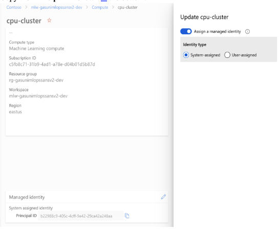
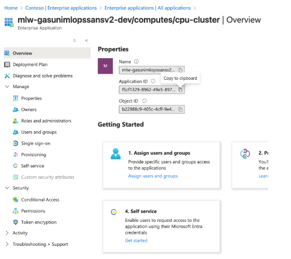
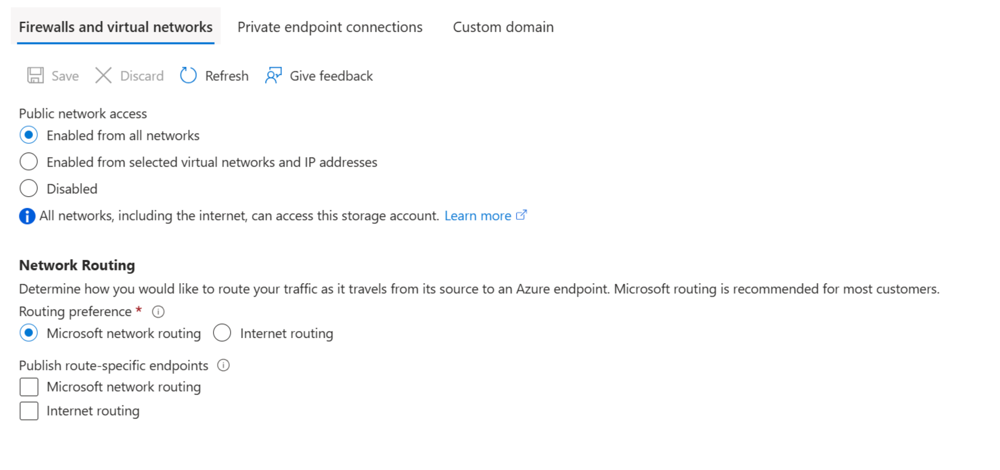
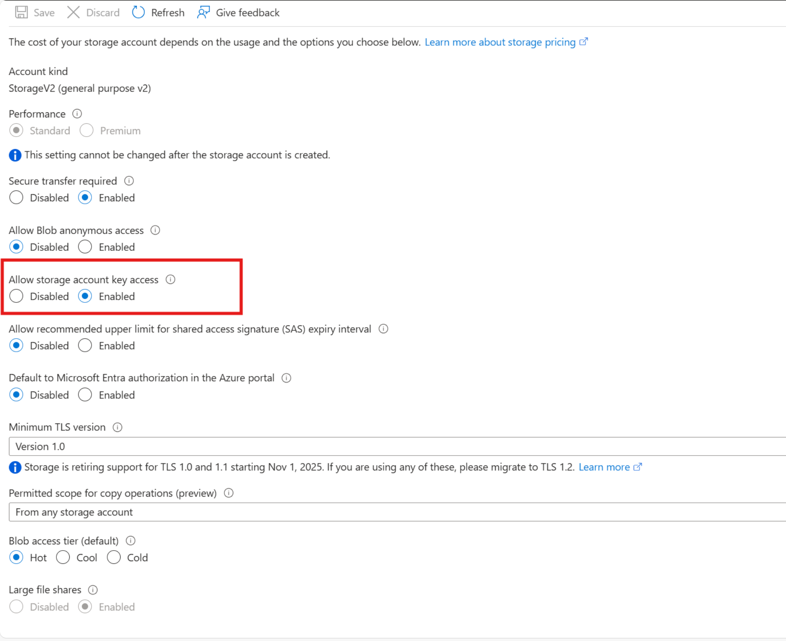
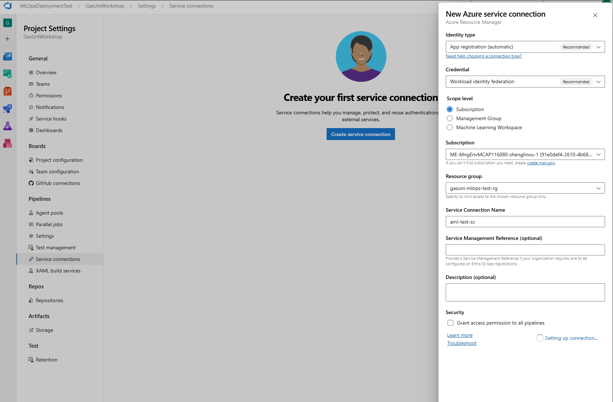
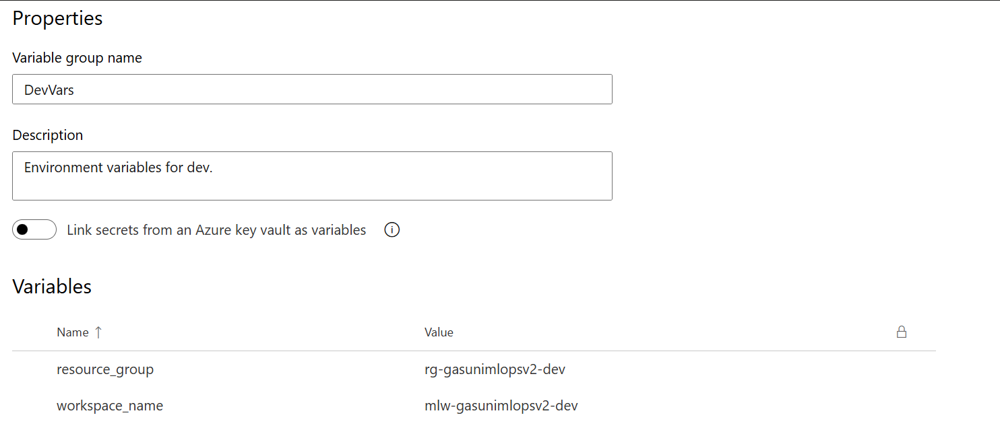
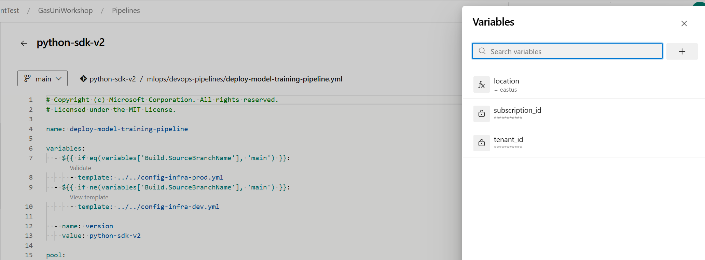

# Azure MLOps v2 End-to-End Setup Guide

## 1\. Prerequisites

- **Azure subscription**
- **Azure DevOps** organization & project
- **Git** installed
- **Python 3.8+**
- **PowerShell** or **bash**

- **Azure Resource Providers enabled:**  
  Make sure the following resource providers are registered in your subscription before deployment:
  - Microsoft.KeyVault
  - Microsoft.Storage
  - Microsoft.ContainerRegistry

## 2\. Local Environment Setup

2.1) Open a terminal (or PowerShell) and clone your repo:

        git clone <your-repo-url>
        cd <your-repo-folder>

2.2) Create & activate a virtual environment:

- **Windows** (PowerShell)

            python -m venv .venv

            .\\.venv\\Scripts\\Activate.ps

## 3\. Azure Resource Deployment

3.1) **Deploy Resources**

        az login

        az account set --subscription <your-subscription-id>

**Note : Ensure you run following script from a User account with contributor rights on the subscription.**

        .\\deploy-azure-resources.ps1 -Environment dev

        .\\deploy-azure-resources.ps1 -Environment prod

- **Post Deployment** (Before workshop)

      Update the random_suffix variable value based on the name of the deployed resources i.e. storageaccount, key-vault. (last 3 digits)

  3.2) **Assign IAM Roles to Users and Compute MI**

1. Under the Resource group deployed (rg-)
2. Enable access the system-assigned identity\*\* on your compute target

   - Got to <https://ml.azure.com> and go to the newly created ML workspace
   - **Compute → \[your cluster\] → Identity → System assigned → On → Save**
   - Copy the **Principal ID** shown in the bottom.

   

3.3) **Locate the Service Principal (Entra) record**

1. In the Azure portal search bar, type **“Entra ID”** (or **“Azure Active Directory”**) and open it.
2. Under **Manage**, go to **Enterprise applications**.
3. In the filter box, paste the **Principal ID** you copied and search.
4. Select the resulting application; on its **Overview** page you’ll see the **Object ID**, copy it.

3.4) **Assign IAM roles to that SP**

1. In Azure navigate to your **Azure ML workspace** → **Access control (IAM)** → **Add role assignment**.
2. Select roles **AzureML Data Scientist** and **AzureML Compute Operator, both**.
3. Under **Assign access to**, choose **User, group, or service principal**, then search for the **Object ID** you just looked up.
4. Click **Select**.![A screenshot of a computer

**Grant Storage roles**

- repeat the IAM assignment on the registry or storage resource, giving **Storage Blob Data Contributor** to the same SP.

  3.5)**Also for your storage account:**

- **Under Networking**, select: **Enable from all networks**! 

- **Under Configuration** set: **Allow storage account key access: enable**

## 4\. Azure DevOps Service Connections

#### 4.1) Push Local Code to Azure DevOps Repo\*\*

1. cd &lt;your-repo-folder&gt;
2. git init
3. git remote add origin &lt;your-devops-repo-url&gt;
4. git add .
5. git commit -m "Initial commit"
6. git push -u origin dev

#### 4.2) Now continue with:\*\*

1. Go to **Project settings** > **Service connections**.
2. Create **Resource Group** connections for dev & prod.
3. Create **Azure ML Workspace** connections for dev & prod.
4. **Name** them:

   - <usecase name>-mlopsv2-aml-sc-dev

   - <usecase name>-mlopsv2-aml-sc-prod

5. After creation, click each and **Authorize** for use in pipelines.

## 5\. Variable Groups

#### 5.1 Setup variable groups

1. In **Pipelines** > **Library**, create two groups: **DevVars** and **ProdVars**.
2. Add these variables (exact names):

   - resource_group
   - workspace_name

     

## 6\. CI/CD Pipeline Setup

#### 6.1 Set up Pipeline Variable

1. In **Pipelines**, click **New pipeline** → **Azure Repos Git** → your repo → **Existing YAML**.
2. Select branch (dev for development, main for production).
3. Point to one of:
   - mlops/devops-pipelines/deploy-model-training-pipeline.yml
   - mlops/devops-pipelines/deploy-batch-endpoint-pipeline.yml
   - mlops/devops-pipelines/deploy-online-endpoint-pipeline.yml
4. Click **Continue**, **Run** to authorize service connections, or **Save**.
5. Repeat these steps for each pipeline you want to create. You'll typically want to set up the model training pipeline first, followed by the endpoint deployment pipelines.

#### 6.2 Set up Pipeline Variable

Edit the pipeline you just created. Add the following variables to the pipeline:

- subscription_id
- tenant_id
- location_id
  

## 7\. Self-Hosted Agent

1. In Azure Devops, Go to **Project settings > Agent pools**, add pool "Self-hosted Agents".
2. Click the pool, then **New agent** to download the agent package.
3. On your target machine:
   1. mkdir myagent && cd myagent
   2. tar zxvf ~/Downloads/vsts-agent-osx-x64-4.258.1.tar.gz
   3. ./config.sh # Follow prompts (devops organisation URL, pool name, PAT)
   4. ./run.sh
4. In your pipeline YAML:

pool:

name: Self-hosted Agents

### 8\. Security Group Access for Attendees

1. **Create Security Group**
   - In Azure Portal > Entra ID (Azure AD) > Groups, create a Security group (e.g., mlops-attendees) and add all attendees as members.
2. **Assign Permissions**
   - Go to the **Resource Group** > Under **Access control (IAM)**, assign these roles to the security group:
     - **Contributor** – allows full access to all workshop resources.
     - **Storage Blob Data Contributor** – allows access to data in the storage account.
3. **Verify Access**
   - Have one attendee log in to <https://ml.azure.com> to confirm they can access the workspace and data.

## 9\. Troubleshooting Highlights

- **Build failures (cython/distutils)** install:
  - sudo apt-get update
  - sudo apt-get install -y python3-distutils python3-dev build-essential libyaml-dev cython3
- **Client secret errors**  
   Double-check that your **service principal’s secret value** (not its ID) is stored in the pipeline’s variable group.

Errors: -

- Need resource provider enabled: - key vault, storage account, container registry [add in prerequisite]
